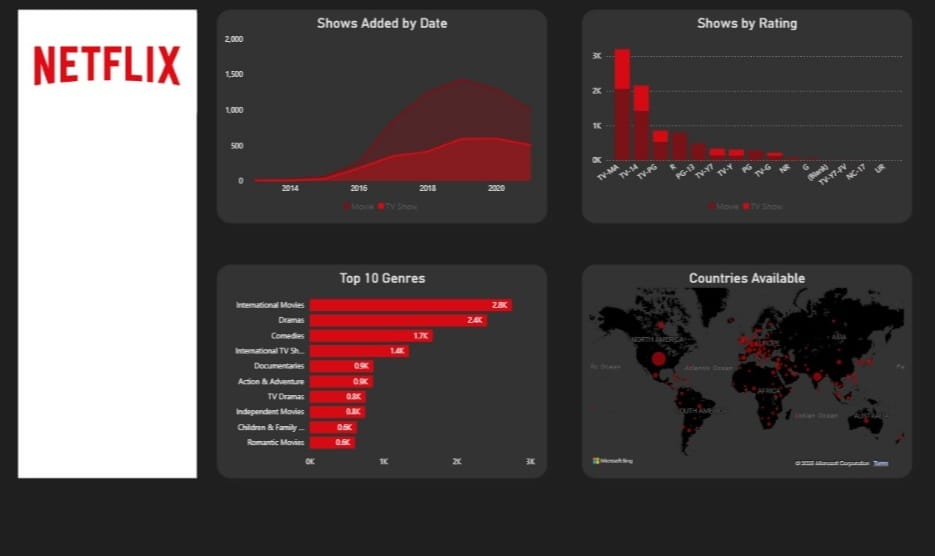

# 📊 Netflix Data Analysis – Power BI Dashboard

## 🔍 Project Overview
This project features an interactive **Power BI dashboard** designed to analyze Netflix’s content library and extract meaningful insights related to content types, genres, geographic availability, and release trends. The dashboard transforms raw data into clear and intuitive visualizations to support data-driven analysis.

---

## 🎯 Objectives
- Analyze the distribution of **Movies vs TV Shows**
- Identify the **top genres** available on Netflix
- Examine **country-wise availability** of content
- Study **content release trends** over the years
- Practice data visualization and storytelling using Power BI

---

## 🛠 Tools & Technologies
- **Power BI Desktop** – Data modeling and dashboard development  
- **Excel** – Cleaning,preparing and structuring the dataset  

---

## 📌 Key Insights
- Movies form the majority of Netflix’s content library  
- The **United States** has the highest number of available titles  
- **International Movies and Dramas** are among the most common genres  
- Content production shows significant growth after **2015**, reflecting platform expansion  

---

## 📷 Dashboard Preview
Below are screenshots of the Power BI dashboard for quick reference:

---

## 📁 Project Files
- `netflix dashboard.pbix` – Power BI report file  
- `screenshots/` – Dashboard preview images  

---

## 🚀 What I Learned
- Creating structured and efficient data models in Power BI  
- Designing interactive dashboards using slicers and filters  
- Presenting insights in a clear, visually appealing manner  

---

## 🔗 How to Use
Download the `.pbix` file and open it using **Power BI Desktop (Windows)** to explore the full interactive dashboard.

---

## 👤 Author
**Sahil Nabi**  
